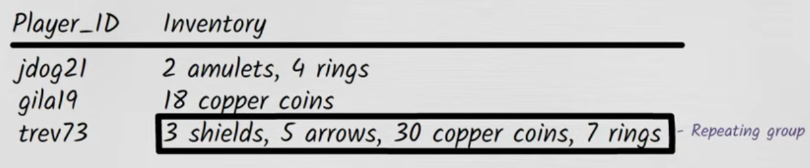
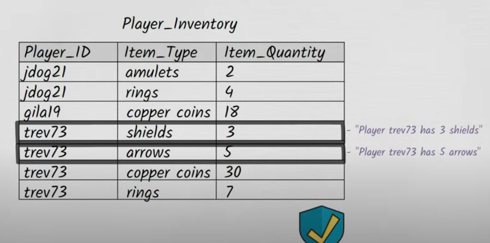
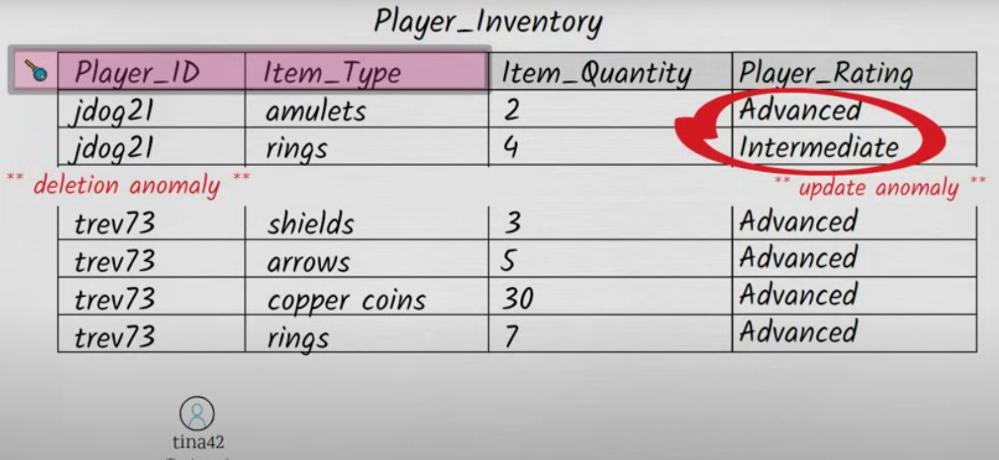
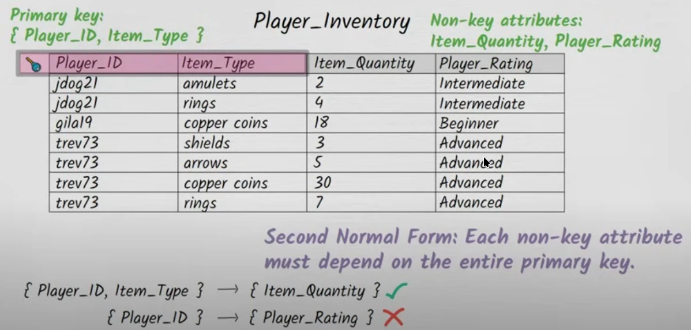
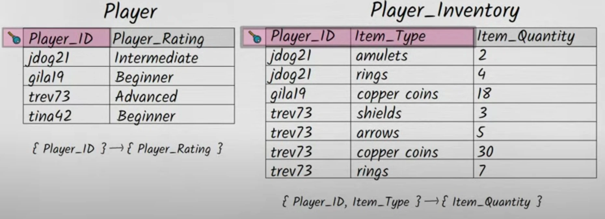
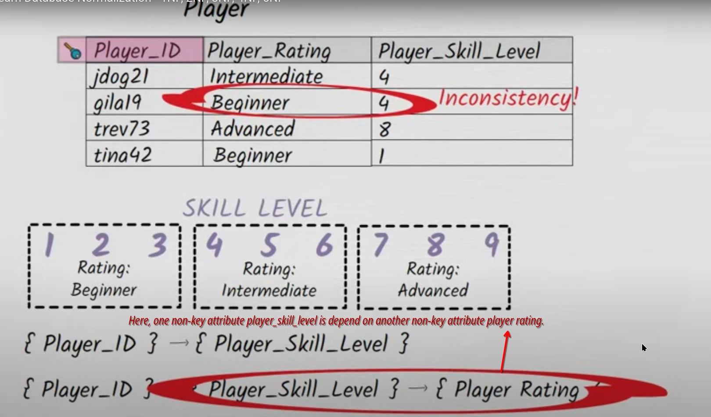
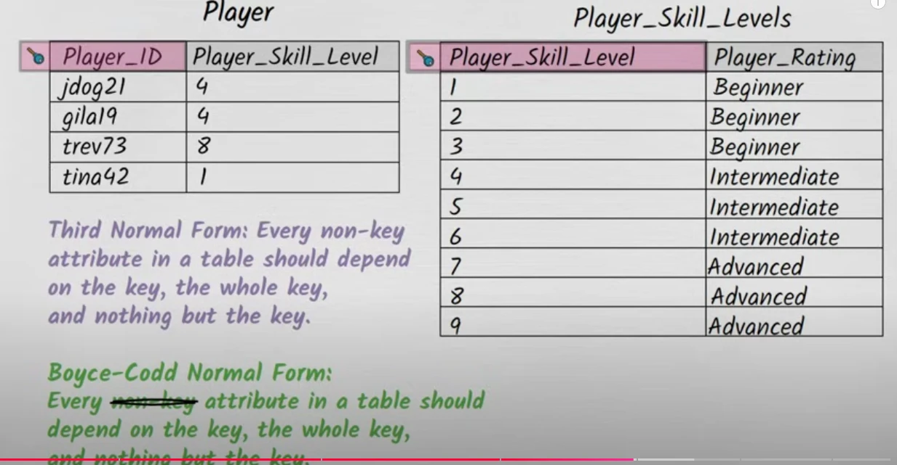
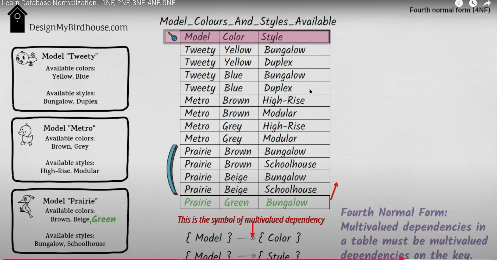
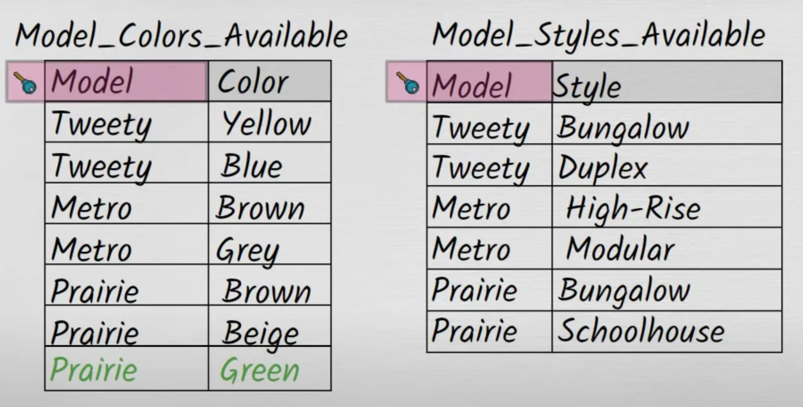

# About Normalization
Normalization is the process of improving the data integrity of the database.
Mainly, it is used to protect the database from a bad database design.

> Here the customer_id 1001 has two dates of birth records


Normalized Tables are:
* Easier to understand,
* Doesn't have any duplicate values,
* Easier to enhance and extend,
* Protected from
  * Insertion Anomaly,
  * Update Anomaly,
  * Deletion Anomaly,

The different types of normalizations are,
* 1NF (First Normal Form),
* 2NF (Second Normal Form),
* 3NF (Third Normal Form),
  * 3.5NF (Boyce-codd Normal Form)
* 4NF (Fourth Normal Form),
* 5NF (Fifth Normal Form)

<!--Writerside adds this topic when you create a new documentation project.
You can use it as a sandbox to play with Writerside features, and remove it from the TOC when you don't need it anymore.-->

    
## 1NF (First Normal Form)
Violation of 1NF is:
1. Using row order to convey the meaning,
2. There should not be more than one datatype in a single column.
3. Each Table should have at least one primary key column.
4. None of the rows should have repeating groups of data.



The repeating group of rows must be written as follows



## 2NF (Second Normal Form)

A table to be said as 2NF if it is already in 1NF and if **no non-prime** attribute 
(attribute not part of the primary key) is **dependent on the primary key or the portion of the primary key.**

Basically, **2NF removes the partial dependency**.

Each non-key attribute must depend on the entire primary key.

Violation of 2NF is

When a column in a table is functionally dependent on another column.

 


Here, The {player_id, item_type} primary key depends on the non-primary_key item_quantity. But only the
  {player_id} attribute depends on {player_rating} the column instead of a whole primary key.



The solution to this problem is splitting the table.



## 3NF (Third Normal Form)
A table is said to be 3NF if it is in 2NF and there is **No Transitive dependency between non-prime attributes**

### Transitive Dependency
When **column A depends on column B**, and **column B depends on column C** then **column A Transitively depends on column C**.

Every non-key attribute in a table should depend on the key, Whole key,and nothing but a key.


Here, one non-key attribute `{player_skill_level}` depends on another non-key attribute `{player_rating}`(This is called transitive dependency)



The solution to the above issue is



### 3.5NF (Boyce Codd Normal Form)
3.5NF is the mote stricter version of 3NF.
Every ~~non-key~~ attribute in a table should depend on the key, Whole key,and nothing but a key.
<note>BCNF is very much similar to the 3NF & 3.5NF is not an official name (but some text books call it as 3.5NF)</note>

## 4NF (Fourth Normal Form)
Multivalued dependency is a type of dependency that exists when one attribute in a table uniquely determines another attribute set, without any functional dependency on other attributes.

1. A multivalued dependency occurs when one attribute in a table determines multiple independent values of another attribute.
2. 4NF ensures there are no non-trivial multivalued dependencies in a relational schema.
3. To achieve 4NF, the table is decomposed into separate tables, ensuring that multivalued attributes are separated.

<note>In other words, if A determines B and A determines C, and B and C are independent, this is a multivalued dependency. </note>

Here, It creates `data redundancy` because for each `model-color pairing`, all the `styles` are repeated, and vice versa. 



The solution for this problem is to split the table into two separate tables, one for the model-color pairing and another for the styles.



## 5NF (Fifth Normal Form)

5th Normal Form (5NF), also called Project-Join Normal Form (PJNF), is a level of database normalization in which a relation is decomposed into smaller relations in such a way that it eliminates redundancy and ensures lossless join. The focus of 5NF is to handle cases where there are `complex multi-attribute dependencies`, also known as Join Dependencies.

<note>Basically compared to 4NF, In 5NF we join the separated table to produce the value we want. </note>

#### Initial Scenario:
Imagine a table that stores the **skills of employees, their job roles, and the projects they work on:**

| Employee Name | Job Role     | Project       | Skill         |
|---------------|--------------|---------------|---------------|
| John          | Developer    | Project A     | Java          |
| John          | Developer    | Project A     | Python        |
| John          | Developer    | Project B     | Java          |
| John          | Developer    | Project B     | Python        |
| Sarah         | Designer     | Project A     | Photoshop     |
| Sarah         | Designer     | Project B     | Photoshop     |
| Sarah         | Designer     | Project B     | Illustrator   |

---

#### Observations:
In this table:
- One **Employee Name** (e.g., John) can have multiple **Skills** (e.g., Java, Python).
- One **Employee Name** can work on multiple **Projects** (e.g., Project A, Project B).
- One **Employee Name** can have one **Job Role** (e.g., Developer or Designer).
- **Skills have no direct relationship with Projects or Job Roles.**

---

#### Problem:
This table contains redundant data. For example:
- John has "Java" as a skill and works on **both Project A and Project B**, so "Java" and "Python" skills are repeated for every project John is working on.
- Sarah has "Photoshop" as a skill, which is again repeated unnecessarily across multiple projects.
- If any combination of these relationships changes, the changes will need to be manually applied to every redundant row, increasing the risk of **data anomalies**.

---

### **Breaking Down the Table**
To eliminate this redundancy, we split (decompose) the table into **smaller relations** based on the relationships (projections). We break it into three tables:

Employee-Skill Relationship Table:

   | Employee Name | Skill         |
   |---------------|---------------|
   | John          | Java          |
   | John          | Python        |
   | Sarah         | Photoshop     |
   | Sarah         | Illustrator   |

Employee-Project Relationship Table:

   | Employee Name | Project       |
   |---------------|---------------|
   | John          | Project A     |
   | John          | Project B     |
   | Sarah         | Project A     |
   | Sarah         | Project B     |

Employee-Role Relationship Table:

   | Employee Name | Job Role      |
   |---------------|---------------|
   | John          | Developer     |
   | Sarah         | Designer      |

### How Does 5NF Help?
By decomposing the original table into **three smaller tables**:
* There’s no redundancy in the information. Any information can now be stored **only once**. For example, Sarah’s skill "Photoshop" is no longer repeated for every project.
* Updates are much easier since you don’t have to update redundant rows. For example, If Sarah’s job role changes to "Lead Designer," you only update it in the **Employee-Role Table**.
* There are **no anomalies** because redundant data is eliminated: Deleting records related to one project does not accidentally remove information about an employee’s skills or job role.

### **Reconstructing the Original Table (Lossless Join)**

To reconstruct the original table (lossless join), you can JOIN these three tables:
- Using `Employee Name` as the key:

```sql
SELECT employee_skill.Employee_Name,
       employee_role.Job_Role,
       employee_project.Project,
       employee_skill.Skill
FROM employee_skill
JOIN employee_role 
  ON employee_skill.Employee_Name = employee_role.Employee_Name
JOIN employee_project
  ON employee_skill.Employee_Name = employee_project.Employee_Name;
```

This join will give you the original dataset but without any redundancy.

---

### **When is 5NF Necessary?**
5NF comes into play when:
1. There are **complex relationships** beyond normal keys and dependencies.
2. **Data redundancy** still exists even after applying 4NF.
3. Join dependencies involve three or more attributes.

---

### **Key Summary Points:**
- **5NF** focuses on eliminating redundancy caused by **complex join dependencies** involving multiple attributes.
- It ensures that **relations are decomposed into smaller projections**, which can be rejoined without loss of data (lossless join).
- It results in a more efficient and anomaly-free database by removing all unnecessary dependencies.

5NF is a rare requirement and only applies in **specific use cases** involving highly complex, interconnected data relationships.
